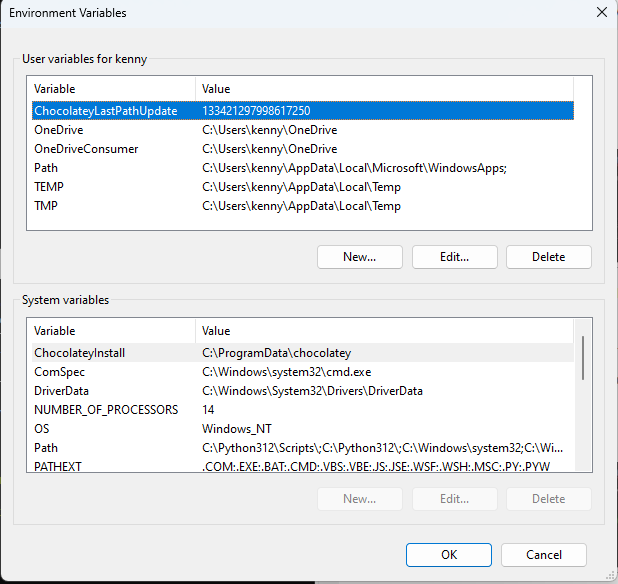

# Windows setup

This document should allow you to set up everything you need for your course on Windows. These instructions have been tested on a fresh install of Windows 11 Pro version 22H2.

## Chocolatey

We will be installing everything using Chocolatey, so head over to [Chocolatey](https://chocolatey.org/install)'s installation page, and follow the instructions.

Do be aware that you will need to open Powershell *as an administrator* to install anything with Chocolatey.

## Adding to the Path

1. Start -> Search for `Edit environment variables for your account`. You should see this window



2. Double click the `Path` variable in the top pane
3. Click `New`
4. Add the path you want to add
5. You can remove paths from this window as well
6. `OK` through all the open system windows
7. Close any Powershell windows you have

## Python

If you require a specific version of Python, or you work on multiple projects with different versions of Python, you should install using pyenv. Otherwise, the `choco` install will be fine.

### Direct installation

1. Install Python using `choco install python` in an admin Powershell.
2. In a normal Powershell window, type `pip --version`. This will confirm that you have installed Python correctly.
3. In a normal Powershell window, type `pipenv install --user pipenv`.
4. You will get a `WARNING: The scripts pipenv-resolver.exe and pipenv.exe are installed in 'some_path' ...`. Carefully copy `some-path` into your clipboard (note CTRL-C doesn't work in Powershell: right click will do the trick, though)
5. Add `some-path` to the Path variable (see [here](#adding-to-the-path))

### Installation using `pyenv`

1. Install pyenv using `choco install pyenv-win` in an admin Powershell
2. Allow Powershell to run scripts by using `Set-ExecutionPolicy RemoteSigned` in an admin Powershell
3. In a normal Powershell window, type `pyenv --version`. This will confirm that you have installed `pyenv` correctly.
4. Run `pyenv install -l` to list all available versions of Python
5. Pick out the latest version with only numbers and full stops in it (so, no `a1` or `-win32`)
6. Run `pyenv install <version>` (3.10.5 at the time of writing). This will download the version of Python and install it.
7. Run `pyenv global <version>` to tell `pyenv` to use your newly installed version of Python.
8. Run `python --version` to verify that it all worked
9. If this opens the Windows Store, remove the `WindowsApps` entry in your user profile `Path` environment variable (see [here](#adding-to-the-path) for more details), close your Powershell, open a new one, and try `python --version` again
10. `pip install pipenv`
11. `pipenv --version` to make sure that `pipenv` is properly installed

## Pycharm

1. In powershell, type `Get-Command python` to get the location of the Python program
2. Also, `Get-Command pipenv` to get the location of the `pipenv` program
3. Install with `choco` in an administrator Powershell `choco install pycharm-community`.
4. Start Pycharm
5. CTRL-ALT-S for settings
6. Click 'Python Interpreter' (about half way down the left panel)
7. Click 'Add interpreter', 'Add local interpreter' (at the top right)
8. Select 'Pipenv Environment'
9. Base interpreter should be the result of step 1
10. `pipenv executable` should be the result of step 2
11. Try creating a new `pipenv` project

To enable you to open Pycharm from Powershell

1. Open a project in Pycharm
2. Double tap SHIFT to open the omnisearch box
3. Search for `Create Command-line Launcher`
4. Add the path that the popup tells you about to your path variable (see [here](#adding-to-the-path) for details)
5. Try `pycharm .` in a folder to see if you can launch Pycharm from the command line.

## MySQL

* `choco install mysql.workbench` (this was broken at the time of writing: you can download it [here](https://dev.mysql.com/downloads/workbench/))
* `choco install mysql` (this will set an empty password on the server.)
* `choco install dbeaver`

To set a password on your server
* Connect to the server from workbench/DBeaver: no password is required
```
ALTER USER 'root'@'localhost' IDENTIFIED BY 'password';
```
* Reconnect to your local server with your new password

## Other dev tools

Install the following using an administrator Powershell.

* `choco install vscode`
* `choco install poshgit`
* `choco install insomnia-rest-api-client`
